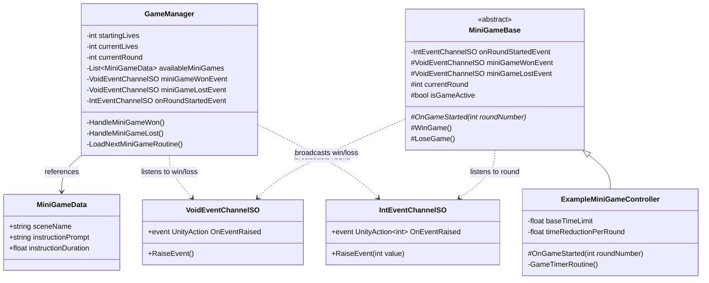

110# WarioWare Mini-Game Developer Guide

Welcome to the team! This guide explains how to build independent mini-games for our WarioWare-style framework. 

The core system uses a **decoupled, event-driven architecture**. As a mini-game developer, **you do not need to touch or reference the `GameManager`**. Everything communicates via ScriptableObject event channels and scene loading.

---

## 1. System Architecture & Class Diagram

The diagram below illustrates how the Core Manager, Event Channels, and Mini-Games interact:

---

## 2. Core Concepts

1. **Additive Scene Loading**: Your mini-game lives in its own Unity Scene. The `GameManager` loads your scene additively on top of the persistent Manager scene, then unloads it when the game finishes.
2. **Round-Based Difficulty**: When your mini-game scene finishes loading, `MiniGameBase` receives the current `roundNumber` from the `onRoundStartedEvent`. Use `roundNumber` to dynamically adjust speed, hazard counts, or time limits.
3. **Win/Loss Reporting**: Call `WinGame()` or `LoseGame()` on your `MiniGameBase` controller when the objective is resolved.

---

## 3. Step-by-Step: Creating a New Mini-Game

### Step 1: Create your Mini-Game Folder & Scene
1. Create a dedicated folder for your mini-game (e.g., `Assets/MiniGames/DodgeTheRocks/`).
2. Inside your folder, create a new Unity Scene (e.g., `DodgeTheRocksScene.unity`).
3. Add all your graphics, prefabs, audio, and gameplay elements into this scene.

### Step 2: Write your Mini-Game Controller Script
Create a C# script that inherits from `MiniGameBase` instead of `MonoBehaviour`.

### Step 3: Wire Event Channels in the Inspector
Attach your controller script to a GameObject in your mini-game scene. In the Inspector, assign the 3 shared Event ScriptableObjects (located in `Assets/Settings/Events/` or `Assets/Mohamed/ScriptableObjects/Events/`):
* `On Round Started Event`: Assign `StartMiniGameEvent` (IntEventChannelSO)
* `Mini Game Won Event`: Assign `MiniGameWonEvent` (VoidEventChannelSO)
* `Mini Game Lost Event`: Assign `MiniGameLostEvent` (VoidEventChannelSO)

### Step 4: Register in `Build Settings` & Create `MiniGameData`
1. Open **File -> Build Settings** and add your mini-game scene to the Scenes In Build list.
2. In the Project window, right-click -> **Create -> MiniGames -> MiniGame Data**.
3. Configure the asset:
   * **Scene Name**: Exact name of your scene (e.g., `DodgeTheRocksScene`).
   * **Instruction Prompt**: Short command for the player (e.g., `"DODGE!"`).
   * **Instruction Duration**: `1.2` seconds.
4. Add your new `MiniGameData` asset to the `GameManager`'s **Available Mini Games** array (don't push that as it will make a conflict in the main scene).

---

## 4. Golden Rules for Developers

1. **NEVER reference `GameManager`**: Do not use `FindObjectOfType<GameManager>()` or singletons. Always use `WinGame()` / `LoseGame()`.
2. **Clean Up Coroutines & Physics**: Always check `if (!isGameActive) return;` in `Update()` or collision callbacks to avoid triggering win/loss twice.
3. **Self-Contained Camera & Canvas**: Include a Main Camera (remove the audio listner) and Canvas inside your mini-game scene so it functions fully when tested independently in the editor.
